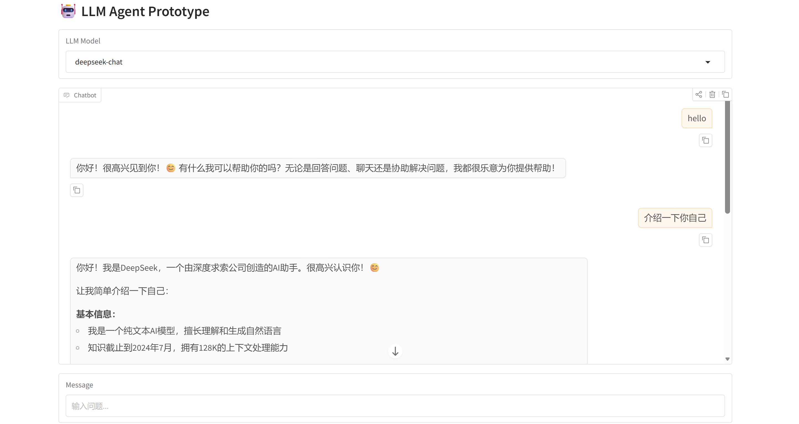
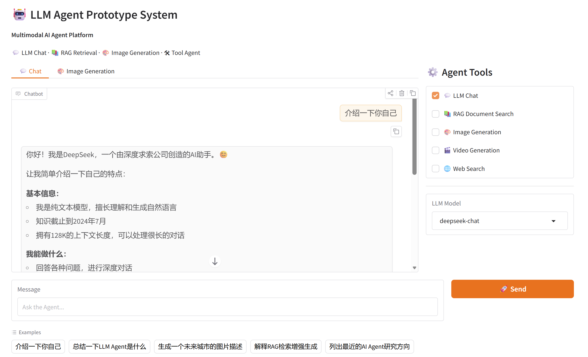

# 版本管理
## v0.1
- ✅界面搭建
- ✅LLM：联通。使用Deepseek API。
- ✅自动测试：test/test_llm_connection.py。使用**pytest**命令
- ✅github备份



## v0.2
- ✅增加界面视觉特征
- ✅增加UI接口:
    - ✅增加图像生成接口：bug，显示不了图片
    - ✅增加RAG接口：目前只有UI，需要增加上传文件动态读取功能。

## v0.3
- ✅添加完整RAG pipeline
    - Vector DB: FAISS
    - embedding model: sentence-transformer
- ✅图片改成图像框输出。推荐比例（80%）。
    - 布局：chatbot | image | agent tools
- ✅pdf在线阅读

- 部署上Qwen-2.5-7B

image generation栏可以去除。
- 实现图像显形。
- 添加天气、日期接口。



能否在线部署？

# TODO
- **推理向**：可以测试某些经典benchmark，推理向。cot、web search、react框架，甚至说是multiagent
    - 加入最简单的模式。cot。"Let's think step by step." 
    - 预期拨款：6分

- ❌️：封装一个sd api。如果绘图，LLM 重写prompt（提示词）。启动模型。部署在GPU上，随时待命。（临时否决）

qwen 2.5 omni

未来的话，推理优化。

对于简历贡献：
多模态智能体原型系统（LLM Agent Platform）

基于 Qwen2.5 / DeepSeek API 构建推理型 Agent 系统。

核心工作：

- 构建 LLM Agent 推理框架，支持 CoT / ReAct 推理模式

- 实现 工具调用机制（Web Search / Image Generation）

- 在 GSM8K benchmark 上评估推理能力

- 通过 Chain-of-Thought prompting 提升推理准确率

结果：

Baseline: 32%
CoT: 45%
Self-consistency: 49%


## v1.0
- 版本条件：拿够6分

累计分数：6

项目投入上限：24小时（开发时间）。

# QuickStart
创建环境：
```
conda create -n agent python=3.10 -y
conda activate agent
pip install -r requirements.txt
```

设置API_KEY:
```
export DEEPSEEK_API_KEY=sk-xxxx
```